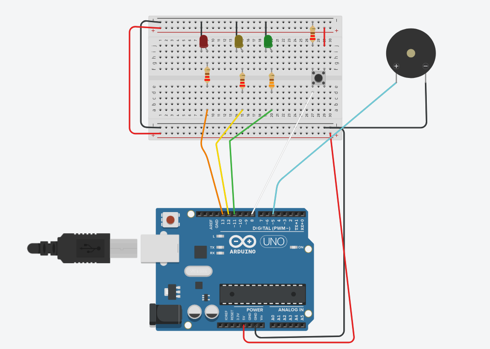
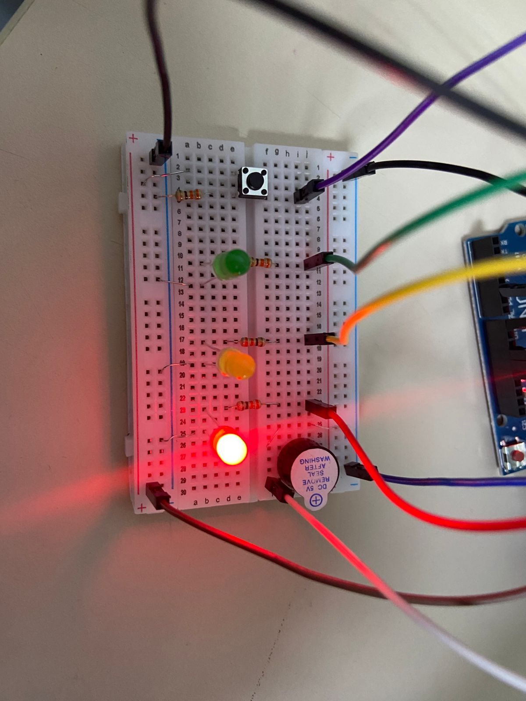
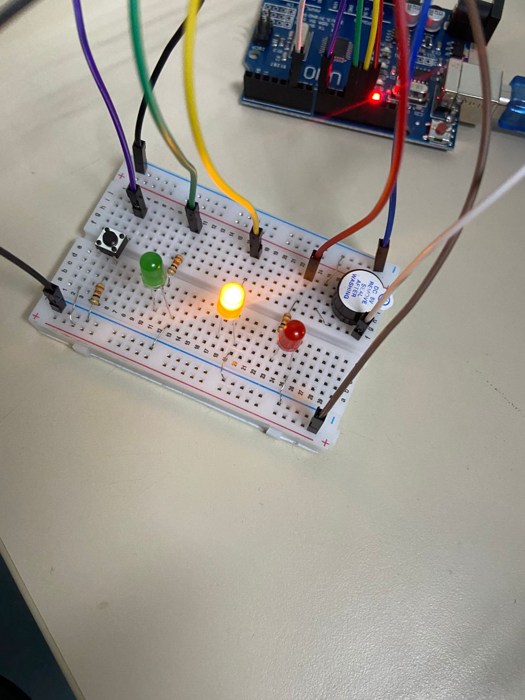
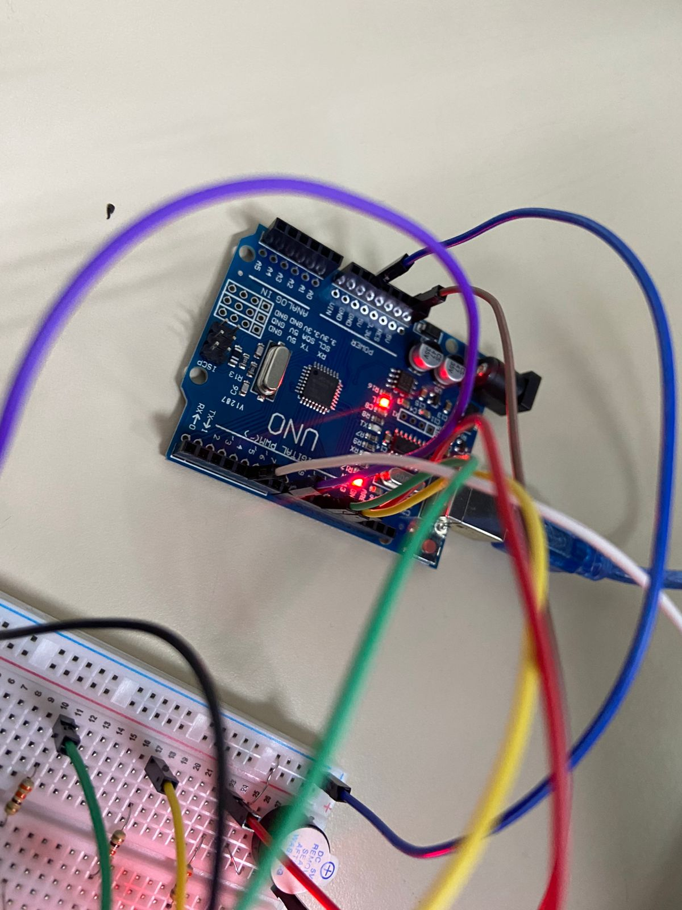
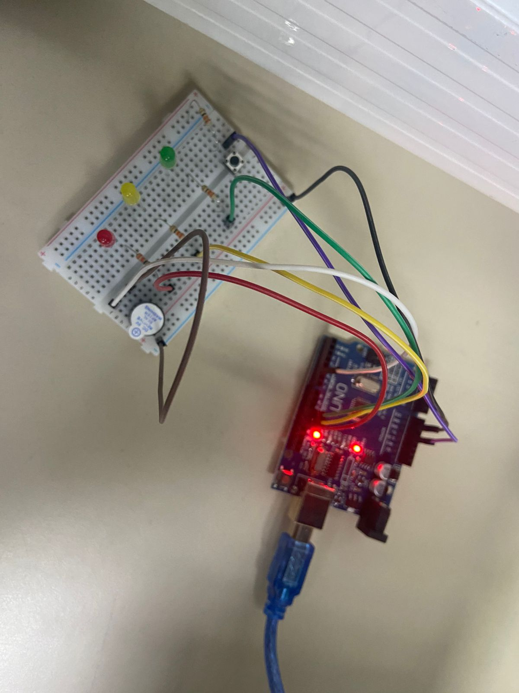

# Semáforo com simulação de trânsito

## Descrição
O projeto simula um semáforo e um carro que será controlado pelo usuário por um botão. Se o usuário tentar passar no sinal vermelho e amarelo, um alarme soará.
O projeto foi simulado digitalmente no site Tinkercad.



[Link para o circuito no Tinkercad](https://www.tinkercad.com/things/cAcLReR0zg6-semaforo-com-o-aviso-de-passou-no-farol-vermelho?sharecode=51FGQJrBNMYSjFHFrg-ELpj4igLAnCl1bAkZp8bi810)

## Componentes Utilizados:

| Quant. | Nome do Componente | Especificação | Valor |
|---|---|---|---|
| 1| Placa Arduino |Uno   | R$ 50,00 |
| 1| Protoboard| 400 pontos  | R$ 21,70 |
| 3| LED difuso |  5mm     | R$ 1,50 | 
| 1| Buzzer Ativo |   5V   | R$ 2,00 |
| 1| Push button| 3mm    | R$ 1,00 | 
| 4 | Resistores|  330 R | R$ 0,70 - 10 unidades | 
| TOTAL |--------- |--------- |R$ 76,90|


## Vídeo do projeto:
[Link para o vídeo do projeto funcionando](https://youtu.be/mx6vIpZOsIk)

## Explicação do uso dos componentes: 

### LEDs 
Com cores vermelho, amarelo e verde, são utilizados para representar o funcionamento de um semáforo. Suportam uma corrente máxima de 20mA.

### Resistores
Utilizados para controlar a corrente que passa pelo LED. A tensão utilizada no circuito é 5V do arduino. Os LEDs suportam até  20mA(0,02A) de corrente sem queimar. Logo, utilizando a 1° Lei de Ohm:
> V = R * I \
> 5V = R * 20mA
> R = 250 Ω \
Devemos ter no mínimo 250Ω nos resistores, então os resistores de 330Ω funcionam bem para o circuito. 

### Push Button:
É o componente interativo do sistema, que ira representar o trânsito de um carro. \
Quando o botão não está pressionado, funciona como um fio entre o contato metálico de um mesmo lado do botão. Quando está sendo pressionado, funciona como um fio entre dois contatos opostos. 

### Buzzer:
É o componente utilizado para soar o alarme. Funciona com a variação de tensão, e assim varia de frequência sonora.

## Código Arduino;
````c++
//definição de variáveis e dos pinos utilizados
int counter;
const int ledVM = 13;
const int ledVD = 11;
const int ledAM = 12;
const int botao = 8;
const int buzzer = 5;


void setup()
{
  pinMode(ledVM, OUTPUT);
  pinMode(ledVD, OUTPUT);
  pinMode(botao, INPUT);
  pinMode(buzzer, OUTPUT);
  pinMode(ledAM, OUTPUT);

 for (counter = 0; counter < 1000; ++counter) {
//acender os leds do semáforo, primeiro o led verde
    digitalWrite(ledVD, HIGH);
    digitalWrite(ledVM, LOW);
    delay(1500); // Wait for 1500 ms

    digitalWrite(ledVD, LOW);
    digitalWrite(ledAM, HIGH);
// se o botao for pressionado, ativa o buzzer com uma frequência de 1000Hz por 1,5 s
    if (digitalRead(botao) == HIGH) {
      tone(buzzer, 1000, 1500); 
    }
    delay(1500);

    digitalWrite(ledAM, LOW);
    digitalWrite(ledVM, HIGH);

// se o botao for pressionado, ativa o buzzer com uma frequência de 500Hz por 1,5 s
    if (digitalRead(botao) == HIGH) {
      tone(buzzer, 500, 1500);
}
    delay(1500);

    noTone(buzzer);  // para o som no buzzer 
  }
}

void loop()
{
  delay(10); // Small delay for performance
}


`````
## Imagens do Projeto:









## Membros do Grupo:
- Ana Julia França  - 16838230\ 
- Maria Fernanda Maia - 16889342\ 
