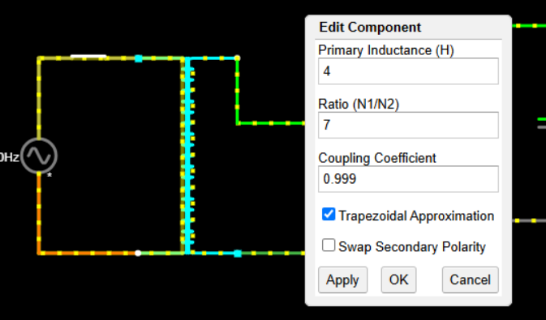
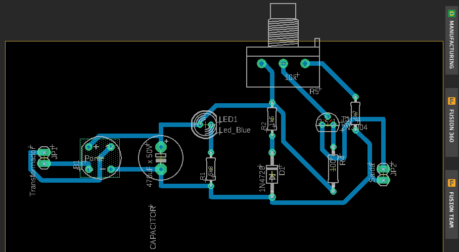
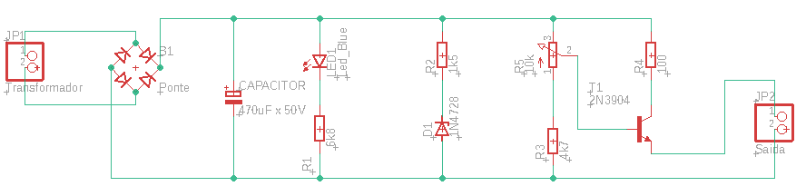
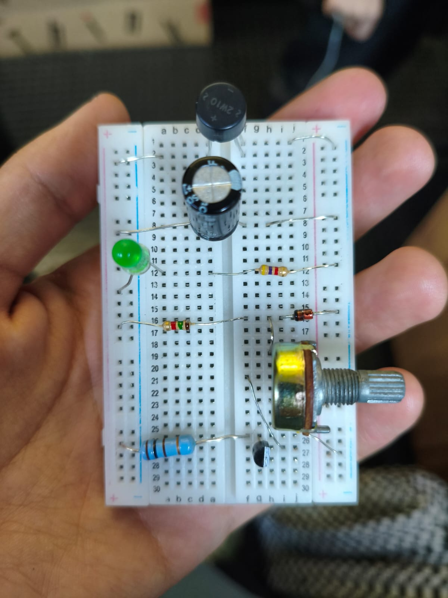
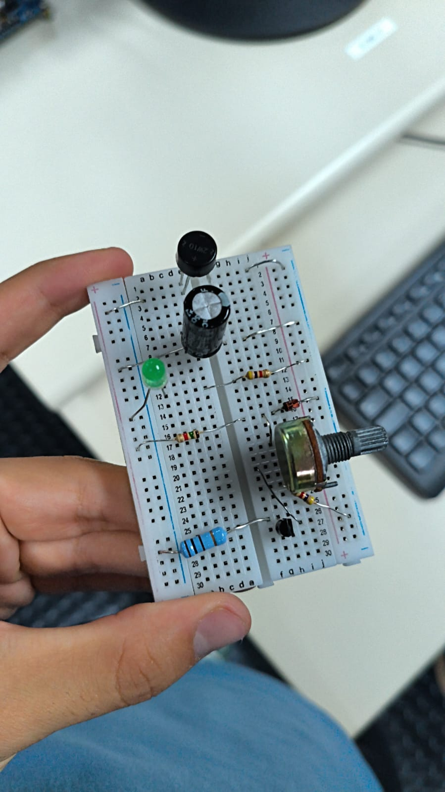

# Fonte Reguladora de Tensão 

## Descrição
O projeto visava a construção de um circuito de uma fonte de tensão ajustável entre 3V
a 12V com 100mA de corrente na carga. Tendo como a tensão de entrada uma tomada de
127V.
O projeto foi simulado digitalmente no site Falstad.

[Link para o circuito no Falstad](https://tinyurl.com/2bbb4j2l)

## Circuito no  EAGLE:

Os arquivos .bdr e .sch para abertura no EAGLE estão na pasta "Arquivos_EAGLE"
bem como a  versão em PDF para impressão

## Vídeo explicando o projeto:

[Link para o vídeo](https://drive.google.com/file/d/12u-_e9nXhzFPCVaqadtqyPuUy2_YhOlK/view?usp=sharing)

## Componentes Utilizados:

| Quant. | Nome do Componente | Especificação | Valor |
|---|---|---|---|
| 1| Protoboard         | 400 pontos    | R$ 8,90 |
| 1| Ponte Refiticadora | 2W10M 2A 800V    | R$ 3,90 | 
| 1| Capacitor eletrolítico| 470uF x 50V     | R$ 1,68 |
| 1| LED difuso         | 5mm    | R$ 0,20 | 
| 2 | Resistores| 4k7 1/4W | R$ 0,90 - 10 unidades | 
| 1 | Resistor | 1k5 1/4W | R$ 0,90 - 10 unidades |
|1 | Resistor | 2W 100ohm | R$ 1,20 |
|1 | Diodo Zenner | 13V 1W | R$ 0,50 |
|1 | Potenciômetro Linear | 10k | R$ 2,20 |
|1 | Transistor NPN |  2N2222A | R$ 2,60 |
| TOTAL |--------- |--------- |R$ 22,98|

## Explicação do uso dos componentes: 

### Transformador:
Neste circuito o transformador é o componente inicial. Seu papel é transformar a tensão
de pico vinda da tomada em uma tensão menor, proporcional ao número de espiras de cada
um dos lados.
No circuito, é necessário realizar a retificação da corrente alternada vinda da tomada, que é realizado pela ponte retificadora.\
O transformador escolhido para o projeto, após essa retificação, mediu 24,2V no capacitor.
Desse modo, conseguimos calcular a proporcionalidade no número de espiras para colocar no simulador.

> Vpico = 127 * √2 ≈ 179,61 V ≈ 180 V

> Relação de espiras: 179,61 ÷ 24,2 ≈ 7,4

### Ponte Retificadora (Ponte de Diodos):
A corrente da tomada se comporta de maneira alternada, a ponte de diodo tem como objetivo direcionar o caminho da corrente em um único sentido, transformando em corrente contínua. Desse modo, é possívelaproveitar a corrente vinda de ambas as direções.\
Sabe-se também que a ponte provoca uma queda de aproximadamente 2 * 0,7V (utilizamos a ponte de silício).

### Capacitor:
O capacitor serve principalmente para armazenar energia para fornecer corrente em transientes de carga. Isso resulta em
uma tensão de saída mais estável e suave, protegendo os componentes eletrônicos sensíveis de picos de tensão e flutuações.
Para calcular a capacitância, é necessário primeiro calcular a tensão de ripple (sendo o ripple menor que 10%).\
Calculando a corrente total do circuito:

> Itotal = Icarga+ Iled + Izenner + Ipotenciometro\
  Itotal = 0,1 + 0,0045 + 0,0018 = 0,1063 A\
  C = Itotal / (f * Vripple)\
  Vripple = 0.1 * 24,2V = 2,42V \
  C = 0.1 / (2 * 60 * 2,4 ) = 347,22 μF
  
  Onde I é a corrente, f a frequência e Vripple a tensão de ripple.

Desse modo, para respeitar um ripple menor que 10%, era necessário pegar um capacitor com capacitância maior que 347,22 μF. Assim, escolhemos o de 470 μF (fácil de se
encontrar comercialmente e um membro do grupo já o tinha).

### Diodo Zenner:
O diodo zenner tem como função limitar a tensão que sairá do circuito para até 12V.\
Desse modo, utilizamos o diodo zenner de 13V que possibilita esta limitação de tensão, permitindo chegar ao resultado desejado (de 3 a 12V) no final do circuito.

### Potênciometro:
O potenciômetro é o componente do circuito capaz de modificar sua resistência interna.Desse modo, seu papel é poder ajustar a tensão de saída do circuito à medida que alteramos a sua resistência.

### Transistor: 
O transistor é o componente que faz com que uma mudança na carga não altere resto do circuito.

### Resistores:
Os resistores ligados ao led, ao diodo zenner, ao potenciômetro e ao transistor foram escolhidos de modo a respeitar a corrente máxima suportada por eles (segundo as especificações). Assim, pegamos os que tínhamos disponíveis e verificamos se essa corrente máxima era respeitada.

## Imagens do Projeto:

\

## Membros do Grupo:
- Ana Julia França 
- Maria Fernanda Maia  
- Pedro Otavio

